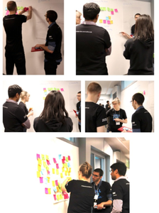
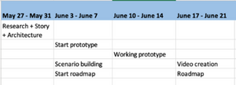
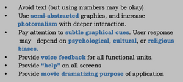

# Making it Real with IBM's Call for Code

## Initial Event
It’s Monday, May 13th, 2019. Our IBM Lab in Ottawa, Canada, organizes an IBM internal Call for Code event, where 55 high-tech employees formed 11 teams to solve disaster-related problems. We just sat down at a table, mixing with people we never met, all eager to see what the day would bring.
First we viewed a video introduction on what Call for Code can mean for the world, and Alvin Francis, our Lab executive for Call for Code told a personal story about how he survived several hurricanes at Dominica. Then, we were asked to choose a type of disaster that we wanted to innovate a solution for. Each of us started listing down all the natural disasters that we could possibly think of, and we had a tie for most votes between flood and drought. Ottawa was just recovering from one of the severest floods in its history, so many of the other teams chose “flood” as the problem to tackle, but our team chose “drought”, just because we wanted to be different.

The next step was to create an “empathy map” related to a person experiencing the disaster topic we chose. An empathy map is one of the Enterprise Design Thinking tools to empathize with the people who we’re designing a solution for. It asks the team to identify what a person would say, hear, think and do when experiencing the situation of interest; in our case “Drought”. This is not an easy task if you are living in Ottawa, Canada, where severe drought has not been on our minds at all.
Luckily, also because we are living in Canada, the diversity of our team was the seed of our solution. Our team consists of people originating from India, China, Northern Africa, Europe and Canada. Gaurav was our go-to person to answer the questions we had. As we dove deeper into who is most affected by drought, we focused on a female farmer, Rani, who grows her rice crop on just a small 1-acre plot of land in India. She also has to take care of 2 children and her father, and we also identified she only had a few years of elementary schooling.

We asked ourselves:
- how would it be to experience living in that situation during a drought?
- What crop is she probably growing?
- How does that plot of land look like?
- What kind of work does she perform, and what kind of decisions does she need to make?
- Where does she get information about upcoming weather relevant to her location?
All these questions made us realize that it’s very hard for a small farmer in a developing country to know when to water their crop, since the weather forecast is often targeted at a very large area. More importantly, getting access to detailed forecasts seems to be very difficult.

Once we had a clear picture of our main target persona and the decisions she faced, we had to define the solution: the technology and the story, all in just two hours. We exchanged ideas, did some research, and we put the pieces together as a story in a presentation, and quickly decided on a name “Liquid Prep”, just so we had a temporary name… we could always change it later.

We presented our idea in just under 5 minutes, while many other participating teams used 10 minutes or more to explain their great ideas. Ottawa had a very lively Call for Code session that day, and it was great to hear so many solutions for different disasters. Once the day was over, we continued with our normal work activities, not expecting too much from our efforts.

## Let's Continue

Then, within the week after the event, we received a message from the Ottawa Lab’s Call for Code organizing committee that our team’s idea was chosen to receive further guidance to submit. This message made us think, what if we were able to submit our idea for the greater good? What if we could work together to create a solution for people confronted with drought? We went to the first mentoring session organized by Firas Kazem and others, and they told us why they liked our idea, that it was really focused on solving a big problem, with the human at the center of the solution. Our randomly formed team was starting to get excited. We only had one month left to submit our Call for Code idea, with a prototype, a technical architecture and a 3-minute video to explain the solution. We decided to make the idea real.

To make this a success, we set up twice-a-week meetings with our team. The first step was to create a plan on what we should have finished by when. 

## Research
We divided up the work for the research. The research had different topics, so each person took a topic to look into and explain that at the next meeting we had already planned. Our mentors provided us information about the IBM Watson Decision Platform for Agriculture ([link](http://biz.weather.com/Agri_Decision-Support-Platform-Launch_LP.html)) that was coincidently just announced.
We looked into Soil moisture sensors, rice cultivation, India government internet coverage, and water usage needs, satellite coverage, impact of drought on crops, and how to design a solution for illiterate people who only have low bandwidth phones. Additionally, we took a deep look into the newly released IBM Watson Decision Platform for Agriculture, as it provides access to a machine learning platform that leverages complex soil humidity models based on location, and crop health based off satellite imagery. After setting up a meeting and talking to Jagabondhu Hazra, a Chief Scientist at IBM India who was a technical lead on the IBM Watson Decision Platform for Agriculture project, we learned much about the product and decided we’d like to integrate this platform into our solution in the future.
For our design solution, I learned that most semi-literate people in developing countries have access to cheap cell phones. So, because they are semi-literate, 

I was looking for design guidelines that would fit the target audience. I found a research article ([link](https://itidjournal.org/index.php/itid/article/viewFile/243/113)) from Microsoft Research India and Adobe Systems India, describing case studies about text-free user interfaces for illiterate and semiliterate users. The main outcome of this article was that the target audience prefers to have visuals that are neither too abstract, nor too real/photographic, but more something in-between. Additionally, they also prefer to have voice-over text available for each page, that they can invoke repeatedly.