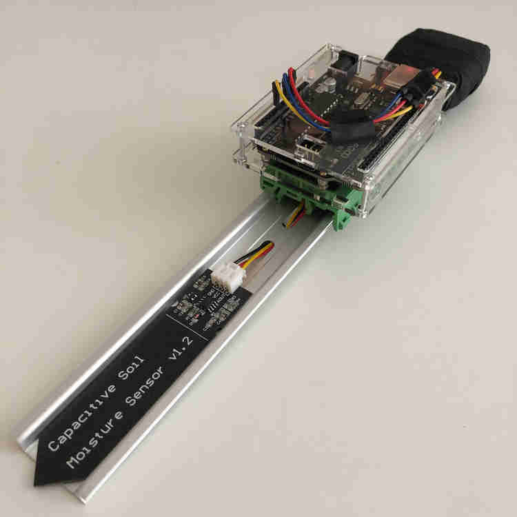

# Building an IoT sensor for the common farmer

During the summer of 2020 myself and a few colleagues from work participated in a design-thinking workshop where we were tasked with developing a hardware/software solution of our choosing over the course of 4 weeks. We used this opportunity to kick off the development of a prototype IoT sensor for the Liquid Prep project that would measure the soil moisture around growing crops. We applied various design-thinking tools during our research in order to empathize with our target users and make sure we built something that they can build, use and afford.

Our research defined the following core criteria:
    1. The sensor has to be cheap. Cost is the major factor inhibiting the adoption of IoT technology for small farmers. Our research showed that our target farmers could afford something in the area of $50 CAD.
    2. The sensor has to use basic hardware for its construction. Either purchasable off-the-shelf parts and/or using supplies that can be found at home. Proprietary hardware is not available in all regions.
    3. The sensor has to be intuitive to use. Many of the smaller farmers in developing areas have little to no experience using electronic devices. We must keep the number of steps required to use the device to a minimum. 
Our goal was to deliver a proof of concept device that could fulfill the basic functionality: measure the moisture of a soil sample and send that data to a device of some kind (phone or computer). To do this, we started by ordering an Arduino microcontroller and a compatible soil moisture sensor. (Microcontrollers are like mini computers - they are awesome for carrying out basic tasks for low size/cost/power)!

Building a hardware sensor in the midst of a global pandemic was an interesting experience. Unlike software which can easily be duplicated and shared between people remotely, building a physical sensor together with a group of remote people had its challenges. To begin, we only had enough resources to build a single prototype sensor. This means only one of us could order all the parts and would have to handle assembling them all together. 

Once the parts arrived at my house, our next couple meetings consisted of me pointing my webcam down at my desk, so my remote teammates could see all the parts/wires and guide me through the assembly process. This was both challenging and amusing at times as we tried to get the instructions across. 

> “Put the blue wire in that connection… NO! The other connection!”

After a few sessions, we had our sensor working. We used a glass of water to calibrate it, and we could see the real-time sensor readings on my computer screen. I even ran outside to give it a quick test in some actual soil. We mounted the moisture sensor and microcontroller to a 30 cm ruler stick, and we were done! 

## Version 1 Sensor

Although it did not use the most robust parts and would still need significant durability enhancements before it could be used regularly on a farm; it proved that we could successfully measure the moisture of a soil sample and send that signal to an external device like a computer or smartphone (and all for under $25 CAD)!

In September, our Liquid Prep team participated in a virtual deployment where we had some new members join our team for the course of six weeks to help build up the solution. Having been involved in the development of the version 1 sensor, I lead the development of our next version 2 sensor construction. For the V2 sensor I had one focus in mind: durability. This time, I had the resources to order numerous parts and experiment with different materials and tools to simplify the sensors construction and increase its durability. The largest challenge while building up the sensors durability was to ensure I continue using off-the-shelf parts. Custom-made/proprietary hardware has its advantages: ease of connectivity between parts, perfect fit, and specific function; but these advantages come at a cost and would prohibit us from delivering a product small farmers could actually afford. We had to think outside the box and use everyday materials wherever we could.

## Version 2 Sensor

The V2 sensor can be seen above. Notice the improvements over the V1 sensor.
1. An aluminum DIN rail serves as a backbone for the entire assembly. Aluminum is a strong and lightweight material. It also does not rust like many other metals. 
2. The Arduino Uno microcontroller is encased in a plastic shroud, decreasing the risk of damage from water/dirt. 
3. An ergonomic handle (made from hockey tape!) makes the sensor easier to carry around, and take in/out of the soil. 
4. Velcro straps to attach the Arduino Uno to the aluminum rail. This makes it easy to take off the microcontroller if the need to change/update the software is required

The instructions for building the current Liquid Prep sensor can be found [here](https://github.com/Call-for-Code/Liquid-Prep/blob/master/soilSensor/User-Manual.pdf).
Stay tuned for further improvements and feel free to contribute!

