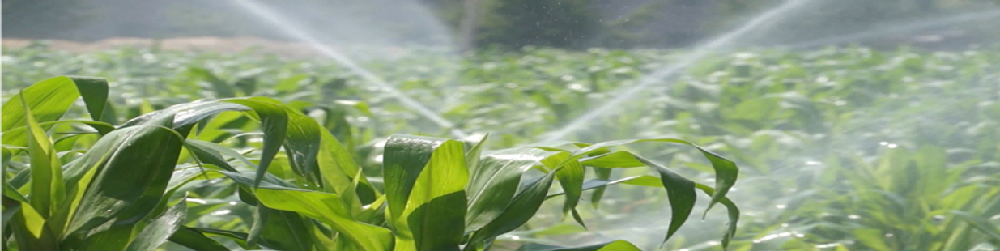
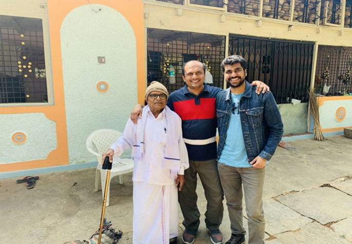
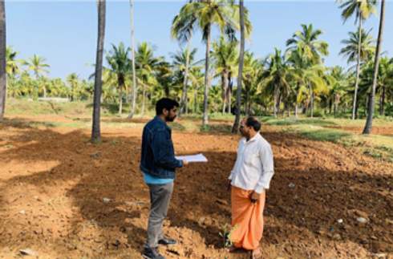
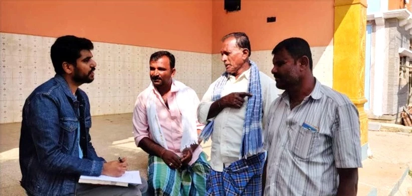
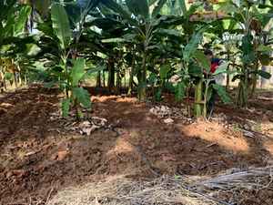

# LiquidPrep: Solving farmer's water crisis one drop at a time!

  
While the “water” crisis is complicated and can be attributed to the culmination of a variety of issues, the major cause of the crisis lies within the agricultural industry, where 70 percent [1] of all water drawn is used for agriculture.

Water is being drawn round the clock to support agriculture in various parts of the world – often to grow highly water intensive crops (such as rice, sugarcane, cotton and banana). Sometimes this happens to be in severely water stressed regions of the world where they solely depend on the rains or the existing groundwater. A recent research[2] explains the extent of water scarcity in the world today, that poses a significant threat to the agriculture industry, which lead us to think - in today’s day and age, why not use the progression of technology to help the farmers best utilize the little of this valuable resource they have at their disposal. This thought led us to this great idea called Liquid Prep, an end-to-end solution for farmers looking to optimize their usage of water; especially during times of drought. More details about the Liquid Prep idea is covered in another [blog](https://www.liquidprep.org/post/making-it-real-with-ibm-s-call-for-code) written by Ilse Breedvelt.

[1] : [https://www.nationalgeographic.com/news/2018/03/world-water-day-water-crisis-explained/](https://www.nationalgeographic.com/news/2018/03/world-water-day-water-crisis-explained/)  
[2] : [https://www.ncbi.nlm.nih.gov/pmc/articles/PMC3386121/](https://www.ncbi.nlm.nih.gov/pmc/articles/PMC3386121/)  
[3] : [https://data.worldbank.org/topic/agriculture-and-rural-development?locations=IN](https://data.worldbank.org/topic/agriculture-and-rural-development?locations=IN)

---

While on my trip I got in touch with a friend of mine (wearing red and blue t-shirt seen in the picture above), who was kind enough to invite me to his home in a little village by the name of Nuggehalli near Hirisave town in Hassan district of Karnataka, India where I was presented with an opportunity to interview a few farmers who lived and owned farmland around the area.  

  
I first spoke to 52-year-old Karibassappa Sashtry (wearing white shirt in picture above), who lives with his wife and two daughters, and his only source of income is farming. He owns about 1.7 acres of land, and he grows millets and grams. While these are low water consuming crops, he relies on the rain to water them.

I also had a chance to speak to Prabakar DK (41) (wearing pink shirt in picture 3), Nagaraju Thammaiah (35) (wearing white shirt in picture 3) and Dinesh Manjegowda (41) (wearing white and blue stripe shirt in picture 3) and like Karibassapa they all owned about 3-5 acres of land and farming was their only source of income to support their family who was living with them

